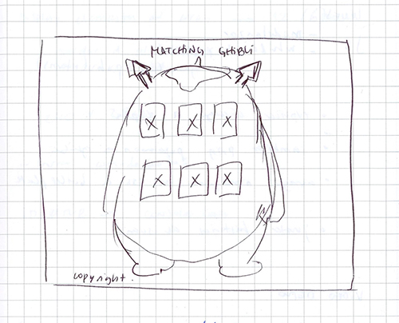

# MAKKURO MEMO

## Índice

* [Makkuro Memo](#makkuro-memo)
* [Instrucciones de uso](#instrucciones-de-uso)
* [Interfaz](#interfaz)
* [Prototipos](#prototipos)
* [Historias de usuario](#historias-de-usuario)
* [Test de usabilidad](#test-de-usabilidad)
* [Enlace](#enlace)

## Makkuro Memo
Makkuro Memo es un juego memorice web inspirado en cuatro películas de animación japonesa de la productora Studio Ghibli, específicamente aquellas creadas por Hayao Miyazaki: El castillo ambulante, Mi vecino Totoro, El viaje de Chihiro y La princesa Mononoke. El nombre del memorice hace honor a Makkuro kurosuke, también conocidos como Susuwataru, personajes recurrentes en el mundo de Miyazaki.
Está dirigido a un público infanto-juvenil, pero con un único nivel de dificultad que genere un desafío para sus jugadores: un puntaje, un límite de intentos fallidos y un timer.


## Instrucciones de uso
Para jugar Makkuro Memo:
1. Hacer clic en botón "jugar"
2. Elegir categoría (set de cartas) que se desea jugar.
3. Las cartas estarán boca abajo, por lo que se deberán destapar dos para poder hacer el primer intento de match (emparejar cartas).
4. Cuando comience el juego, también iniciará un contador regresivo y un conteo de giros fallidos, por lo que se perderá si el contador llega a 0 antes de hacer todos los matches o si se llega al límite de giros fallidos permitidos (10).
5. En caso contrario, si se logra hacer todos los matches a tiempo y dentro del límite de giros, el jugador ganará.
6. El puntaje que el jugador reciba dependerá de en cuántos intentos logró hacer todos los matches. El puntaje máximo (ningún error) es de 10. Por cada intento fallido, se descuentan 10 puntos.
7. Al ganar o perder aparecerá un botón de reiniciar que llevará nuevamente a la pantalla de categorías y que permitirá volver a jugar una partida.

## Interfaz

### En desktop


<details>
<summary> Clic para ver las siguientes pantallas del juego </summary>
  
> 
  
> 
  
> 
</details>
<br>

### En iPhone 7


## Prototipos

### 1. Prototipos baja fidelidad:


<details>
<summary> Clic para ver </summary>

> 

> 
</details>
<br>

### 2. Prototipo alta fidelidad:
#### - Desktop


---

#### - iPad


## Historias de usuario

### 1. "Quiero un juego simple, que no necesite registrarse".
```
CRITERIOS DE ACEPTACIÓN:
- Sin input.
- Solo un botón de clic que inmediatamente lleva al juego.
- Cartas inmediatamente desplegadas luego del clic.
- Cartas deben estar al azar.

DEFINICIÓN DE TERMINADO
- Botón jugar implementado.
- Cartas barajadas al azar con función shuffle.
- Clic debe reconocer ID de elementos y guardar la información.
- Se deben mostrar las cartas boca arriba al hacer clic.
- Se implementa un efecto flip.

```
### 2. "Me gustaría poder jugar en celular".
```
CRITERIOS DE ACEPTACIÓN:
- Debe ser responsivo.
- Se debe ver igual en pc de escritorio y notebook de la dupla.


DEFINICIÓN DE TERMINADO
- Está implementado media query en iPhone 6, 7, 8, X, Galaxy S5, iPad, Kindle Fire HDX y notebook con resolución pequeña.
- Se crea un CSS aparte para media query.
- Se quita el background de la grilla original en móbiles.
- El header sube en móbiles.
```
### 3. "Me gustaría reconocer si las cartas que elegí son pares o no".
```
CRITERIOS DE ACEPTACIÓN:
- Cartas deben hacer match.
- Al hacer match las cartas se deben destacar de alguna forma.
- Si no hay match, las cartas giran boca abajo.


DEFINICIÓN DE TERMINADO
- Función de match implementada.
- Se corrigen errores y se limita el hacer más de los clics correspondientes.
- Se diseña una respuesta evidente al hacer match.
```

### 4. "Quiero saber si gané".

```
CRITERIOS DE ACEPTACIÓN:
- Debe haber una pantalla de resultados luego de perder o ganar.
- Pantalla debe indicar puntaje.


DEFINICIÓN DE TERMINADO
- Dos funciones nuevas: una que indica cuando se ganó y otra cuando se perdió.
- Se agrega un nuevo módulo llamado ScoreDisplay.
- Se agrega una nueva pantalla de resultados que bloquea la grilla de cartas.
- En pantalla debe indicarse el puntaje obtenido al ganar.
```
### 5. "Quisiera poder volver a jugar".

```
CRITERIOS DE ACEPTACIÓN:
- En pantalla de resultados debe haber un botón que reinicie el juego.

DEFINICIÓN DE TERMINADO
- Se agrega botón de volver a jugar en pantalla de resultados (al ganar y al perder).
- Botón debe indicar el llamado a la función de Categories.
```

### 6. "Necesito un juego desafiante".

```
CRITERIOS DE ACEPTACIÓN:
- Indicador de giros (intentos fallidos) y timer regresivo.

DEFINICIÓN DE TERMINADO
- Se agregan dos nuevos elementos que indican los intentos fallidos y el temporizador.
- Se crea un nuevo módulo timer.
```

### 7. "Quisiera poder jugar con diferentes cartas".

```
CRITERIOS DE ACEPTACIÓN:
- Deben implementarse cuatro categorías de cartas de películas de Studio Ghibli.

DEFINICIÓN DE TERMINADO
- Se crea un nuevo módulo CategoriesDisplay.js.
- Se implementan set de cartas de cuatro películas: El castillo ambulante, Mi vecino Totoro, El viaje de Chihiro y La princesa Mononoke. 
- Se modifica la función de play en Intro.js, ahora lleva a CategoriesDisplay.js.
- Trabajo en Photoshop para crear nuevas cartas.
- Se carga la data JSON a través de fetch.
```


## Test de usabilidad

Hacia el final del tercer sprint se realizó un test de usabilidad de nuestro producto: 

|<sub> EDAD USUARIA 	|<sub>JUGABILIDAD 	|<sub> DIFICULTAD 	|<sub>ASPECTO VISUAL 	|<sub>RESPONSIVO 	|<sub>EXPERIENCIA DE USUARIO	</sub>|
|---	|---	|---	|---	|---	|---	|
|<sub>5 AÑOS	|<sub>Intuitiva. Pierde al inicio debido al cronómetro, pero comprende con facilidad qué debe realizar.|   <sub>Alta debido al cronómetro.	| <sub>Lo encuentra bonito. Le gusta que los sets de cartas sean de películas que en su mayoría reconoce.  	|  <sub>Mejora su jugabilidad en móbil. A pesar de la dificultad, comienza a ganarle al cronómetro y pierde poco. Prefiere el celular 	|  <sub>Adictiva. Jugó varias veces sin parar.  	|
|   <sub>10 AÑOS	|  <sub>La primera vez le cuesta entender qué significa la pantalla de categorías.  	|   <sub>Difícil la primera vez, pues no reconoce de inmediato que un cronómetro está corriendo.	|  <sub>Le gusta mucho. Le llama la atención el contraste de colores y las animaciones.  	|   <sub>Prefiere jugar en celular o en tablet, lo encuentra más sencillo.	|   <sub>Lo disfruta mucho. Juega por casi una hora. Desea ver una de las películas del set de cartas para poder reconocer las figuras que contiene.|
|<sub>18 AÑOS	|   <sub>Entiende con facilidad qué debe hacer. 	|  <sub>Lo considera desafiante. Le motiva que el contador sea rápido y que haya un límite de intentos. 	|   <sub>Le gustan los colores y las animaciones, pero considera que el cronómetro debiera destacarse más ya que no lo notó al principio	|   <sub>En móbil lo encuentra más fácil y cómodo debido al touch.	|   <sub>Le gustó bastante, con ganas de probarlo varias veces. 	|

De acuerdo con la información recabada, se detectan los siguientes aspectos a mejorar:
- Agregar una instrucción más evidente de qué categoría (set de cartas) se desea jugar.
- Implementar en CSS una cualidad que destaque el cronómetro al iniciar el juego.
  
 ## Enlace
  
  https://nikoguerrero.github.io/SCL017-memory-match-game/

